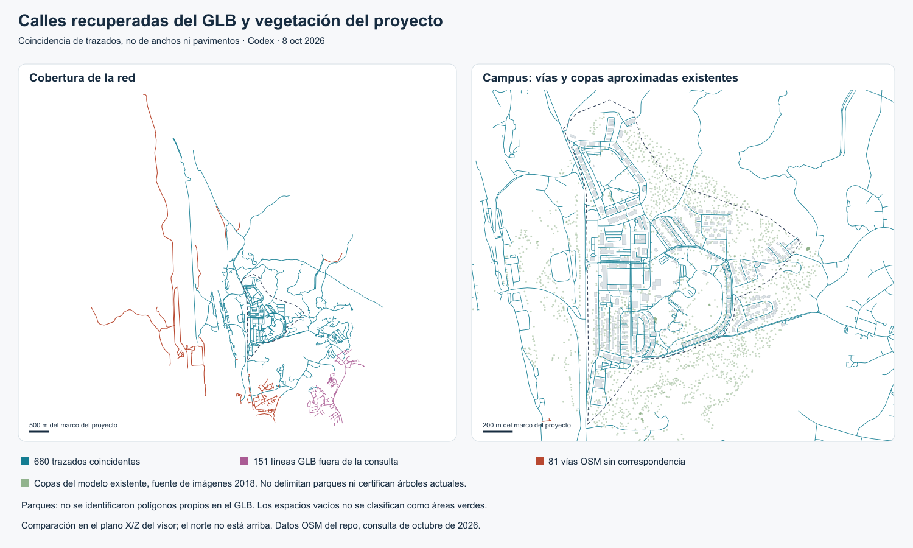

# Calles y parques del GLB y del proyecto

8 de octubre de 2026. Autor: OpenAI Codex, a solicitud de Luis Miguel Caamaño. Ampliación de la [comparación de edificios](README.md). Se inspeccionó el mismo archivo de Descargas y se mantuvo la transformación horizontal obtenida con los edificios, sin reajustarla a las calles.

Actualización de procedencia: LM confirmó que generó el archivo con map3d. La [revisión del exportador](PROCEDENCIA-Y-PILOTO.md) confirma que dibuja las vías en verde: ese color no identifica parques.

**El GLB permite recuperar trazados de calles y caminos, pero no aporta parques identificables ni calzadas listas para incorporar al visor.** Buena parte de los trazados coincide con los datos OSM existentes; el contexto exterior sigue siendo su principal aporte potencial.



## Calles recuperadas

| Elemento | Resultado |
| --- | --- |
| Geometrías auxiliares recuperadas | 811 polilíneas continuas, con 5.538 segmentos |
| Referencia del proyecto | 741 vías OSM, incluidas vías peatonales y otras clases `highway` |
| Correspondencias completas | 660; mismos vértices ordenados, admitiendo sentido inverso, con máximo inferior a 0,1 m del marco del proyecto |
| Líneas GLB sin correspondencia | 151; no intersectan la caja de consulta OSM ni el límite propuesto del proyecto |
| Vías OSM sin correspondencia en el GLB | 81 |
| Error máximo entre vértices de los pares aceptados | 0,0326 m; diferencia interna entre archivos, no exactitud real |

Las correspondencias incluyen Jorge Gil, Carlos Lara, Hill y Parke. Se recuperaron 320 elementos OSM `service`, 153 `residential`, 122 `footway`, 31 `path` y otras clases detalladas en [resultados-vias.json](resultados-vias.json). Estas cantidades son elementos cartográficos, no calles únicas: una calle puede estar dividida en varias vías OSM. Los nombres y tipos vienen de OSM; el GLB no los conserva.

No se ha demostrado la clase de las 151 líneas exteriores. No hay líneas adicionales de ese grupo dentro del límite propuesto. El GLB tampoco reemplaza toda la red de referencia, porque 81 vías no tienen correspondencia según el criterio aplicado.

## Por qué las calles no aparecían en la inspección inicial

Las coordenadas del trazado están en `_INSTANCESTART` y `_INSTANCEEND`. En cambio, `POSITION` contiene una pequeña plantilla de ocho vértices; las primitivas se exportaron como triángulos sin material. Las coordenadas recuperadas están todas a Y = 0,1 en unidades originales, sin relieve vial.

La [prueba con GLTFLoader](loader-vias.json) confirma que las 811 piezas se cargan como `Mesh` ordinarios, sin instancias, con `MeshStandardMaterial` y la misma caja de geometría de (−1, −1, 0) a (1, 2, 0). Los atributos especiales sobreviven, pero el cargador no reconstruye las carreteras a partir de ellos. Por eso la imagen inicial del GLB no mostraba una red vial distribuida por la ciudad.

Codex leyó esos atributos para dibujar el plano de análisis. **No se corrigió ni reexportó el GLB.** Una integración necesitaría reconstruir la geometría de las líneas, decidir anchos y materiales, y apoyarla en el terreno. El archivo no conserva esos atributos como una capa vial utilizable directamente.

## Diferencia con las calles que ya dibujamos

`fuente/contexto.mjs` crea calzadas y aceras a partir de OSM, les asigna anchos por clase y las apoya en el terreno. Junto al 106 usa las calles modeladas en `sitio.glb`, evita duplicarlas y ajusta progresivamente los ejes OSM a Jorge Gil y Carlos Lara. Por tanto, la coincidencia con los ejes OSM no significa identidad con cada borde de asfalto publicado.

El generador excluye `path`, `track` y `elevator`. El GLB contiene correspondencias para los 31 `path` ya disponibles en OSM: podría ayudar a visualizarlos en una auditoría, pero no añade esos datos. El conteo incluye incluso un elemento OSM `elevator`, otra razón para no llamar automáticamente «calle» a cada línea.

## Parques y áreas verdes

No se identificaron nombres, etiquetas ni superficies propias que permitan delimitar parques en el GLB. Sus 991 mallas volumétricas y 811 geometrías auxiliares agotan la estructura inspeccionada. Hay 12 líneas cerradas: 10 coinciden con elementos OSM de acceso vehicular, camino peatonal o ascensor, y las otras 2 están fuera de la consulta. **Una línea cerrada o un espacio vacío no prueba la existencia de un parque.**

En el proyecto actual, el terreno del contexto se reviste con el material de pasto sobre una rejilla de relieve. Ese fondo verde no clasifica uso del suelo. `fuente/arboles_cds.geojson` contiene 2.337 puntos de copas aproximadas derivados de imágenes de 2018 según sus metadatos; hay además correcciones y exclusiones en la generación de árboles. El plano de este informe muestra los puntos de ese archivo fuente, antes de esas exclusiones, no un censo actual ni el conjunto exacto de árboles renderizados. Ninguno de esos puntos define límites de parques.

Los archivos OSM de edificios y vías inspeccionados no incluyen entidades con `leisure=park` o `garden`, ni las clases de área verde consultadas (`landuse=grass/forest/recreation_ground/village_green`, `natural=wood/grassland/scrub`). Esto describe el contenido de esas descargas, no la ausencia de parques en OSM o en la ciudad. El elemento llamado «Clayton Park» en esa descarga es `highway=service` y `service=driveway`, no un polígono de parque.

La Fundación sí identifica **Parque Deportivo, Parque Los Lagos y la Reserva Biológica Dr. Rodrigo Tarté** como espacios distintos en [Conoce el campus](https://ciudaddelsaber.org/conoce-el-campus), consultado el 8 de octubre de 2026. Esa página permite verificar nombres y categorías; no se extrajeron de ella límites georreferenciados.

## Usos que quedan respaldados

- **Auditoría vial:** conservar la correspondencia por OSM ID y nodo GLB para contrastar continuidad y extensión de la red. Para las vías ya presentes, OSM conserva más información semántica que esta exportación.
- **Contexto exterior:** revisar las 151 líneas exteriores junto con los 325 volúmenes exteriores detectados en el análisis de edificios. Acreditar procedencia, identidad y pertinencia antes de incorporar una muestra.
- **Parques como capa propia:** usar las referencias oficiales para identificar cada espacio y obtener una geometría con fuente, fecha y límite explícito. Diferenciar parque, reserva, copa y césped de fondo. No inferir superficie permeable, propiedad pública o confort por el color verde del render.

No se propone sustituir las calles corregidas junto al 106 ni se presenta este GLB como un inventario de parques.

## Reproducción

Desde la raíz del repositorio, después de ejecutar `comparar.py`:

```sh
python3 docs/ciudad/comparacion-glb/comparar_vias.py /Users/luismiguelcaamano/Downloads/ciudadelsaber.glb
node docs/ciudad/comparacion-glb/verificar-loader.mjs /Users/luismiguelcaamano/Downloads/ciudadelsaber.glb
```

Se generan `resultados-vias.json`, `calles.svg` y `loader-vias.json`. El PNG es una rasterización del SVG con `sharp` del proyecto. Los scripts comprueban la huella del GLB y conservan los datos de la aplicación. La búsqueda de correspondencias exige igual número de vértices y orden directo o inverso entre diez candidatos por centro ponderado por longitud; «sin correspondencia» significa que no cumple esa prueba, no que se haya demostrado inexistencia física.
