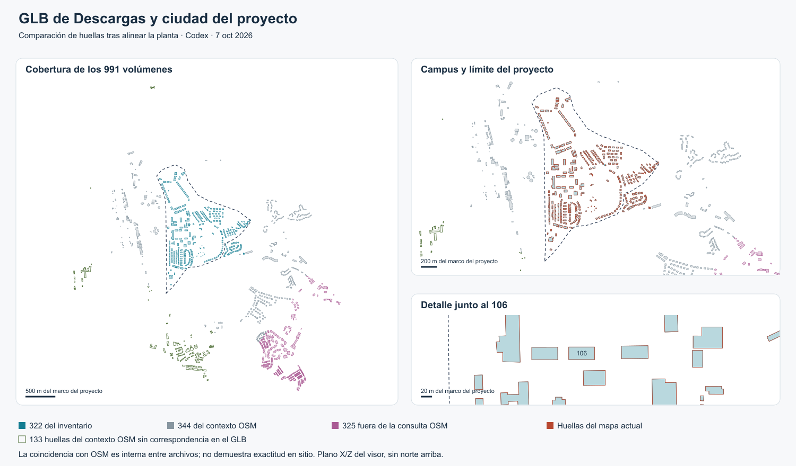

# Comparación del GLB con la ciudad actual

**Dictamen para Claude Code: NO integrar este GLB.** No se ha demostrado una mejora que justifique repetir huellas existentes, reconstruir vías y revisar alturas. La muestra exterior es evidencia de la evaluación, no un piloto de integración recomendado. [Decisión razonada](PROCEDENCIA-Y-PILOTO.md).

7 de octubre de 2026, ampliado el 8 de octubre. Autor: OpenAI Codex, a solicitud de Luis Miguel Caamaño. Base del repositorio: `c826508`, sobre el sitio publicado `75c21ca`. Resultado de una comparación geométrica local; no se ha integrado el GLB ni modificado el sitio. La [procedencia y muestra piloto](PROCEDENCIA-Y-PILOTO.md) incorporan la confirmación de LM de que generó el archivo con map3d y el contraste de sus reglas de escala y altura.

**El GLB repite las huellas de los 322 edificios del inventario actual.** Incluye las 85 cajas grises y el 106. Su aportación potencial está en el contexto exterior, no en nuevas plantas dentro del campus. Las coincidencias casi exactas son compatibles con una base cartográfica compartida con OSM; no acreditan por sí solas la procedencia o licencia del archivo.



## Qué se comparó

Se extrajeron 991 contornos cerrados de las caras inferiores de las mallas volumétricas del archivo `ciudadelsaber.glb`. Se aplicaron las matrices de sus nodos, como al cargarlo en Three.js. Se excluyeron 811 primitivas auxiliares con atributos de líneas instanciadas. No se equipara automáticamente una malla a un edificio independiente.

La referencia son las 799 huellas OSM que devuelven `fuente/contexto-osm.mjs` y `fuente/entorno-osm.mjs`, usando exactamente el registro del proyecto. También se contrastaron las 321 huellas de `datos/ciudad_mapa.json`. El inventario tiene 322 entradas: el generador del mapa omite una marcada como `unido`.

Es una comparación de plantas, cobertura y valores de altura del archivo. No es una comparación de cada triángulo de los GLB publicados, de sus fachadas o de sus cubiertas. El mapa de navegación contiene huellas y alturas aproximadas; no representa todo el detalle visible de cada edificio.

## Resultado

| Comprobación | Resultado |
| --- | --- |
| Correspondencias GLB con la referencia OSM | 666, sin asignaciones duplicadas |
| Edificios del inventario encontrados | 322 de 322 |
| Cajas grises encontradas | 85 de 85 |
| Correspondencias adicionales con el contexto OSM | 344 |
| Volúmenes sin correspondencia | 325; todos sus centroides quedan fuera de la caja de consulta OSM del proyecto |
| Huellas de la referencia OSM sin correspondencia en el GLB | 133, todas ajenas al inventario de 322 edificios |
| Volúmenes adicionales con centro dentro del límite del campus | 0 |
| Volúmenes del inventario con centro dentro del límite | 291; los otros 31 tienen centro fuera y siguen perteneciendo al inventario |

Las 325 piezas exteriores son candidatas para estudiar una ampliación del contexto. El GLB tampoco es un reemplazo completo del contexto actual: no se encontraron correspondencias para 133 huellas de la referencia OSM. La clasificación usa centroides, no intersección de superficies: no prueba que cada polígono quede enteramente fuera ni que todos sean edificios válidos. Tampoco demuestra que el GLB cubra la totalidad de Ciudad del Saber.

## Alineación y precisión interna

La transformación horizontal requiere escala **2,1827563**, giro **34,9957195°** y traslación **(859,464842; −33,552582)** en el marco X/Z del proyecto. En forma explícita, para las coordenadas mundiales del GLB tras aplicar las matrices de los nodos:

```text
x_proyecto = 2.1827563008351407 * (0.8191948932314821*x_glb - 0.5735152368537916*z_glb) + 859.4648415698422
z_proyecto = 2.1827563008351407 * (0.5735152368537917*x_glb + 0.8191948932314819*z_glb) - 33.55258203875137
```

El script descubre un ajuste inicial por votación entre áreas similares, explora escala y varias orientaciones, y refina una semejanza por mínimos cuadrados. Acepta candidatos con centro a menos de 2 metros del marco del proyecto y `abs(log(área_GLB_transformada / área_OSM)) < 0,03`. Las identidades cuyo OSM ID es divisible por 5 quedan fuera de la votación y del ajuste: 529 pares ajustan y 137 sirven como control interno.

En esos 137 controles, el residuo mediano del centro es 0,0050 m, el percentil 95 es 0,0110 m y el máximo 0,0123 m. **Son diferencias entre archivos transformados, no precisión centimétrica sobre el terreno.** El control no es geográficamente independiente de OSM y las correspondencias se seleccionan por proximidad y área.

También se midió la máxima distancia de cada vértice a los segmentos del otro contorno, en ambas direcciones. No es una distancia de Hausdorff continua exacta. El máximo entre las 666 correspondencias es 0,0132 m frente a OSM. Frente al mapa de navegación, redondeado a décimas, el máximo entre sus 321 huellas es 0,0723 m; entre las 85 cajas grises es 0,0696 m. Estas diferencias no sustentan una mejora de planta al sustituirlas por el GLB.

## Alturas y relieve

- 747 de los 991 volúmenes tienen altura 10 en las unidades originales del GLB. Dentro del inventario actual son 272 de 322. La revisión posterior de map3d confirmó la regla de altura genérica de 10 y la reprodujo para 604 de las 666 piezas con identidad OSM recuperada; las 62 restantes siguen la regla de niveles multiplicados por 2,2.
- Todos los volúmenes extraídos arrancan de una base numéricamente cero. No aportan un relieve de apoyo por edificio.
- La pieza identificada como el 106 es el nodo 25 y tiene altura 6,6 unidades originales. El mapa actual consigna 15,7 m aproximados para ese edificio. **No son magnitudes comparables hasta verificar la escala vertical y qué representa cada altura.**
- La escala obtenida en planta no autoriza a multiplicar las alturas por el mismo factor. Tampoco certifica norte geográfico, cotas reales ni exactitud del modelo actual.

## Qué uso queda justificado

1. **Comparación docente y auditoría de procedencia:** conservar esta superposición como evidencia de la repetición de huellas y de la cobertura exterior.
2. **Contexto lejano evaluado:** se identificaron seis piezas exteriores y se revisaron encuadres nominales. No se demostró un beneficio que justifique integrar el GLB; la muestra queda como evidencia, sin recomendar un piloto en el visor.
3. **Revisión de cajas grises:** este GLB no aporta una planta diferente que justifique reemplazarlas. Para mejorar cubiertas o fachadas hace falta otra evidencia.

Las sombras de precisión siguen condicionadas a verificar alturas y cotas. La comparación no justifica sustituir el 106 ni los modelos por tipología ya documentados. La procedencia de la herramienta, la muestra y sus seis identidades OSM quedaron documentadas en [Procedencia y piloto](PROCEDENCIA-Y-PILOTO.md). Siguen pendientes sus alturas reales y cotas.

## Reproducir y continuar en Claude Code

El original permanece en `/Users/luismiguelcaamano/Downloads/ciudadelsaber.glb`. SHA-256: `c09b25daf4eddef945b66ab7d80a82e6a4a3b661f94f55918f776dd3634668a2`. El script rechaza otro archivo para evitar aplicar silenciosamente estos supuestos a otra exportación.

Desde la raíz del repositorio, con Node.js, Python, NumPy y SciPy disponibles:

```sh
python3 docs/ciudad/comparacion-glb/comparar.py /Users/luismiguelcaamano/Downloads/ciudadelsaber.glb
```

Genera [resultados.json](resultados.json), con los pares por OSM ID y nodo GLB, las métricas, la transformación y las huellas SHA-256 de los datos y scripts usados, y [comparacion.svg](comparacion.svg). Probado con NumPy 2.4.3 y SciPy 1.17.1. El PNG es una rasterización del SVG con `sharp` del proyecto. No requiere red ni escribe en los modelos o en los datos de la aplicación.

La [verificación](VERIFICACION.md) recoge la revisión de cifras y límites. La matriz de posibles usos queda en [GLB de Descargas](../GLB-DESCARGAS-USOS.md); la evaluación de [CBE Clima](../../analisis/CBE-CLIMA.md) es independiente de esta comparación.

Ampliación del 8 de octubre: [calles y parques](CALLES-Y-PARQUES.md). Se recuperaron las 811 polilíneas auxiliares, con 660 correspondencias OSM; el GLB no aporta parques identificables. El límite usado en ambos informes es el propuesto por el proyecto, no un límite oficial de la Fundación.
